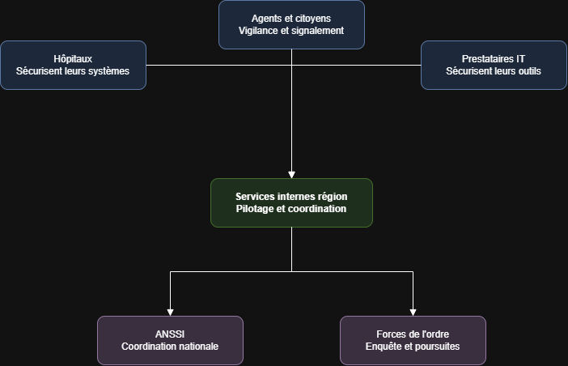
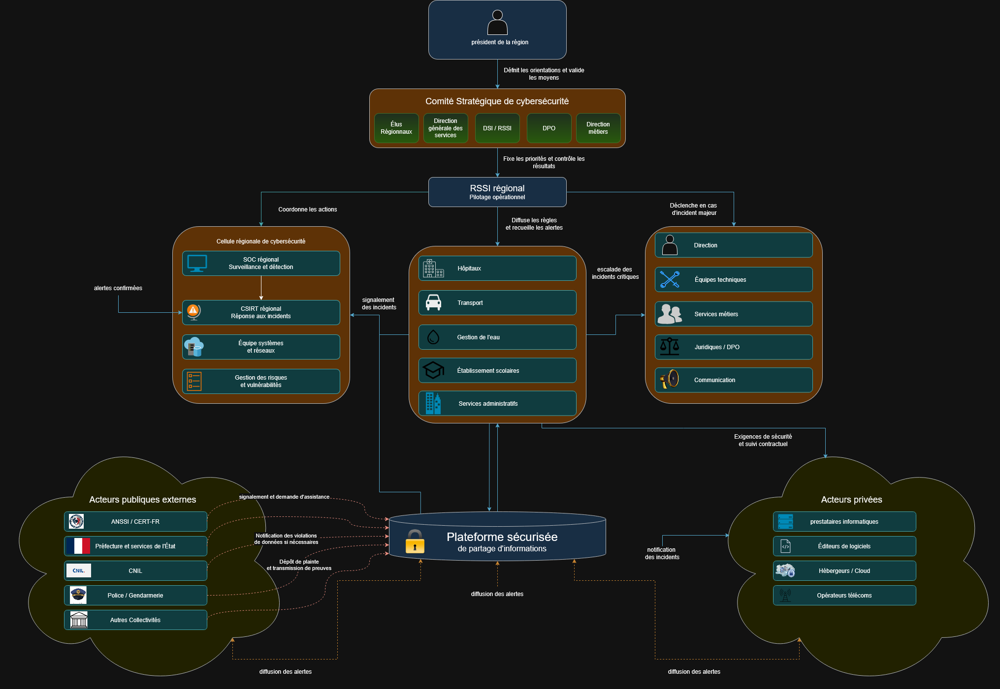

# Remédiation et Législation

**École :** Livecampus  
**Cours :** Remédiation et Législation  
**Professeur :** M. AUMAGY Yannick  
**Livrable :** MINI CAS 1  
**Chapitres couverts :** 1, 2 et 3  
**Modalité :** Travail de **groupe**  
**Groupe :** G1  

**Membres du groupe :**
- BADET Mael
- LEBLOND Tristan
- LOURENCO Quentin
- MASIA Antoine

**Format de dépôt attendu :** `REMEDIATION_ET_LEGISLATION_BADET_LEBLOND_LOURENCO_MASIA_MINI_CAS_1_G1.pdf`

---

## Énoncé du mini-cas

### Contexte

Une grande collectivité territoriale française (**région**) gère des services publics essentiels :

- transports ;
- hôpitaux ;
- gestion de l’eau ;
- établissements scolaires ;
- services administratifs en ligne.

Depuis quelques mois, elle est confrontée à :

- une **recrudescence d’attaques par rançongiciel** ciblant les hôpitaux de son territoire ;
- plusieurs **campagnes de phishing** contre les agents administratifs ;
- des **menaces sur la chaîne d’approvisionnement** liées à ses prestataires informatiques.

Le président de la région souhaite renforcer la cybersécurité et a mandaté votre groupe pour préparer un **plan stratégique de cybersécurité** inspiré de la stratégie nationale, mais adapté au contexte régional.

---

## Réponses aux tâches

### 1. Analyse du contexte et des menaces

La collectivité territoriale gère plusieurs services publics essentiels, notamment les transports, les hôpitaux, l’eau, les établissements scolaires et les services administratifs en ligne. Une cyberattaque pourrait donc avoir des conséquences importantes sur le fonctionnement de la région, sur la sécurité des usagers et sur la protection des données personnelles.

Les risques peuvent être classés selon deux critères :

- **La gravité**, qui correspond à l’importance des conséquences possibles ;
- **La probabilité**, qui correspond à la possibilité que le risque se produise.

#### 1. Les attaques par rançongiciel contre les hôpitaux

Les rançongiciels représentent le risque le plus critique. Ils permettent à un attaquant de chiffrer les données et de rendre les systèmes informatiques indisponibles, généralement dans le but d’exiger une rançon.

Dans un hôpital, une telle attaque peut empêcher l’accès aux dossiers médicaux, aux outils de prescription, aux systèmes de communication ou aux équipements connectés. Elle peut entraîner le report d’opérations, le transfert de patients et une dégradation de la qualité des soins.

La gravité est donc **critique**, car l’attaque peut directement affecter la santé et la sécurité des personnes. Sa probabilité est **très élevée**, puisque plusieurs attaques ont déjà ciblé les hôpitaux du territoire.

#### 2. Les campagnes de phishing contre les agents

Le phishing consiste à envoyer des messages frauduleux afin de tromper les agents et de récupérer leurs identifiants, leurs mots de passe ou de leur faire exécuter un fichier malveillant.

Un compte compromis peut permettre à un attaquant d’accéder à la messagerie, de voler des informations, de diffuser de nouveaux messages frauduleux ou de pénétrer plus profondément dans le système d’information.

La gravité est **élevée**, car une erreur d’un agent peut compromettre plusieurs services. Sa probabilité est **très élevée**, puisque plusieurs campagnes ont déjà été observées et que tous les agents peuvent être ciblés.

#### 3. L’indisponibilité des services publics essentiels

Une cyberattaque peut rendre indisponibles les systèmes liés aux transports, à l’eau, aux hôpitaux, aux établissements scolaires ou aux démarches administratives.

Par exemple, une attaque par déni de service (DoS) peut empêcher l’accès aux services administratifs en ligne. Une compromission des systèmes industriels pourrait perturber la distribution de l’eau ou le fonctionnement des transports.

La gravité est **critique**, car l’interruption de ces services peut affecter une grande partie de la population. Sa probabilité est **élevée**, notamment en raison des rançongiciels, des attaques par déni de service et des dépendances aux prestataires.

#### 4. Le vol ou la divulgation de données personnelles

La collectivité traite une grande quantité de données sensibles : dossiers médicaux, informations administratives, données scolaires, coordonnées des usagers et informations relatives aux agents.

Une fuite de données peut entraîner des usurpations d’identité, des fraudes, une perte de confiance des citoyens et des sanctions réglementaires. Les données volées peuvent également être revendues ou utilisées pour préparer de nouvelles attaques ciblées.

La gravité est **élevée**, en particulier lorsqu’il s’agit de données médicales ou de données concernant des mineurs. Sa probabilité est **élevée**, car le vol de données accompagne souvent les rançongiciels, le phishing et les compromissions de comptes.

#### 5. La compromission des comptes à privilèges

Les comptes des administrateurs et des prestataires disposent de droits élevés sur les serveurs, les réseaux et les applications. Leur compromission permettrait à un attaquant de modifier les configurations, de désactiver les protections, de supprimer les sauvegardes ou d’accéder à des données sensibles.

La gravité est **critique**, car un seul compte à privilèges peut donner accès à une grande partie du système d’information. Sa probabilité est **moyenne à élevée**, notamment en cas de phishing, de mot de passe faible ou d’absence d’authentification multi-facteurs.

#### 6. Les vulnérabilités des systèmes anciens et des équipements connectés

Certains hôpitaux, établissements scolaires ou services de gestion de l’eau peuvent utiliser des logiciels anciens, des équipements industriels ou des objets connectés difficiles à mettre à jour.

Ces systèmes peuvent contenir des vulnérabilités connues exploitables par des attaquants. Ils peuvent servir de point d’entrée dans le réseau ou être rendus indisponibles.

La gravité est **élevée**, car ces équipements peuvent être liés à des services essentiels. La probabilité est **moyenne à élevée**, car les systèmes anciens sont fréquemment présents dans les grandes organisations publiques.

#### 7. La menace interne

Un agent, un prestataire ou un partenaire peut provoquer un incident de manière volontaire ou involontaire. Il peut, par exemple, transmettre des données confidentielles, utiliser un support non sécurisé, supprimer des informations ou accorder des droits excessifs.

Cette menace est difficile à détecter, car la personne dispose déjà d’un accès légitime. Ses actions peuvent donc ressembler à une activité professionnelle normale.

La gravité est **élevée**, notamment si la personne dispose de droits importants. Sa probabilité est **moyenne**, car la majorité des incidents internes sont liés à une erreur ou à une négligence plutôt qu’à une intention malveillante.

#### Classement des risques

| Priorité | Risque                                           | Gravité  | Probabilité      | Niveau global  |
| -------- | ------------------------------------------------ | -------- | ---------------- | -------------- |
| 1        | Rançongiciel contre les hôpitaux                 | Critique | Très élevée      | Critique       |
| 2        | Phishing contre les agents                       | Élevée   | Très élevée      | Critique       |
| 3        | Indisponibilité des services publics essentiels  | Critique | Élevée           | Critique       |
| 4        | Vol de données personnelles                      | Élevée   | Élevée           | Élevé          |
| 5        | Compromission des comptes à privilèges           | Critique | Moyenne à élevée | Élevé          |
| 6        | Vulnérabilités des systèmes anciens et connectés | Élevée   | Moyenne à élevée | Élevé          |
| 7        | Menace interne                                   | Élevée   | Moyenne          | Modéré à élevé |

### 2. Identification des acteurs clés et de leurs rôles

Pour répondre à cette menace, la région ne peut pas agir seule. Plusieurs acteurs doivent intervenir, chacun à son niveau.

*Schéma — coordination des acteurs de la cybersécurité régionale*

#### Les services internes de la région

C’est la direction informatique de la région qui gère au quotidien la sécurité des systèmes (réseaux, serveurs, sites administratifs en ligne). Elle est responsable de la maintenance, des mises à jour et de la première réaction en cas d’incident. Face au phishing par exemple, c’est elle qui doit mettre en place des filtres anti-spam sur les boîtes mails des agents et bloquer rapidement un compte compromis si un agent a cliqué sur un lien piégé.

#### Les hôpitaux du territoire

Ce sont eux qui subissent directement les attaques par rançongiciel. Ils doivent sécuriser leurs propres systèmes (dossiers patients, appareils médicaux connectés) et signaler rapidement toute attaque, car un hôpital paralysé met en danger la vie des patients. Concrètement, ça veut dire faire des sauvegardes régulières et déconnectées du réseau, pour pouvoir restaurer les données sans être obligés de payer la rançon, et avoir un plan de continuité pour continuer à soigner les patients même si les ordinateurs sont bloqués.

#### Les prestataires informatiques

Ce sont les entreprises externes qui fournissent des logiciels ou des services numériques à la région. Comme le contexte le précise, ils sont visés par des menaces sur la chaîne d’approvisionnement : un attaquant peut passer par eux pour atteindre la région. Ils doivent donc garantir la sécurité de leurs propres outils avant de les livrer, par exemple en vérifiant qu’aucun code malveillant n’est caché dans une mise à jour logicielle avant de l’envoyer à la région, et en signalant immédiatement toute faille détectée chez eux.

#### L’ANSSI

C’est l’agence nationale qui coordonne la réponse en cas d’incident grave. La région doit pouvoir la contacter rapidement en cas d’attaque importante, et suivre ses recommandations de sécurité. Par exemple, si un hôpital est touché par un rançongiciel, l’ANSSI peut envoyer des experts pour aider à analyser l’attaque, contenir sa propagation vers d’autres établissements, et donner des consignes officielles (comme ne pas payer la rançon).

#### Les forces de l’ordre (police, gendarmerie)

Elles interviennent après une attaque pour enquêter, identifier les auteurs et engager des poursuites. Leur rôle est plutôt judiciaire : elles n’empêchent pas l’attaque, mais elles agissent une fois qu’elle a eu lieu. Par exemple, après une campagne de phishing, elles peuvent remonter la trace des mails frauduleux pour identifier d’où vient l’attaque et engager des poursuites contre les responsables.

#### Les citoyens et les agents administratifs

Ce sont souvent le maillon faible, car ce sont eux qui reçoivent les mails de phishing. Leur rôle est d’être vigilants, de suivre les formations de sensibilisation et de signaler les messages suspects. Concrètement, un agent bien formé doit savoir reconnaître un mail frauduleux (adresse bizarre, faute d’orthographe, lien suspect) et le signaler au service informatique plutôt que de cliquer dessus. Sans leur participation, même les meilleures protections techniques peuvent être contournées.

Chaque acteur a donc un rôle différent mais complémentaire : les services internes et les prestataires protègent les systèmes en amont, les hôpitaux et les agents sont en première ligne face aux attaques, l’ANSSI coordonne au niveau national, et les forces de l’ordre interviennent après coup pour sanctionner.

### 3. Définition des objectifs stratégiques

Les objectifs stratégiques de cybersécurité :

- **Assurer la disponibilité des services essentiels :** garantir la continuité des services critiques (transports, hôpitaux, gestion de l’eau et des services administratifs…) même en cas d’attaque.

- **Protéger les données des divers systèmes informatiques :** contre les accès non autorisés ainsi que les vols de données. La collectivité doit mettre en place des mesures de sécurité adaptées afin de garantir la confidentialité et l’intégrité des informations, tout en assurant l’imputabilité des actions réalisées sur le système d’information.

- **Préserver l’intégrité des systèmes et des données :** empêcher la modification ou la suppression des données par des personnes non autorisées et garantir la fiabilité des systèmes utilisés par la collectivité.

- **Renforcer la résilience face aux cyberattaques :** améliorer les capacités de détection, de réaction et de récupération après un incident, notamment face aux rançongiciels / cryptovirus.

- **Sensibiliser et former les agents aux risques cyber :** la sécurité d’un système d’information repose également sur la vigilance et les bonnes pratiques de ses utilisateurs. La collectivité doit donc renforcer la sensibilisation et la formation des agents, tout en mettant en œuvre des mesures complémentaires telles que la limitation des privilèges d’accès, la surveillance des systèmes et la sécurisation des sauvegardes.

- **Sécuriser les prestataires et la chaîne d’approvisionnement :** renforcer le contrôle des fournisseurs informatiques afin de limiter les risques liés aux partenaires externes. Cela implique d’intégrer des exigences de cybersécurité dans les contrats, d’évaluer les fournisseurs et de surveiller les accès externes aux systèmes.

### 4. Proposition de gouvernance locale de la cybersécurité

Pour piloter durablement la cybersécurité régionale, la collectivité doit se doter d’une **gouvernance claire** : qui décide, qui contrôle, qui exécute, et comment les informations circulent avec l’ANSSI et les partenaires publics/privés.

*Schéma — gouvernance locale de la cybersécurité (pilotage, contrôle, coordination et partage d’informations)*

#### Qui pilote ?

Le **président de la région** fixe le cadre stratégique : il définit les orientations de cybersécurité et valide les moyens (budget, effectifs, investissements).

Sous son autorité, un **comité stratégique de cybersécurité** réunit les élus régionaux, la direction générale des services, la DSI / le RSSI, le DPO et les directions métiers. Ce comité traduit la volonté politique en priorités concrètes (hôpitaux, phishing, prestataires, etc.).

Au quotidien, le **RSSI régional** assure le **pilotage opérationnel** : il fixe les priorités techniques, coordonne la cellule régionale de cybersécurité, diffuse les règles vers les secteurs (hôpitaux, transport, eau, écoles, services administratifs) et déclenche la cellule de crise en cas d’incident majeur.

#### Qui contrôle ?

Le **comité stratégique** contrôle les résultats : il vérifie que les objectifs sont atteints, que les moyens sont utilisés correctement et que les risques critiques (rançongiciels, phishing, supply chain) diminuent.

Le **RSSI** contrôle l’exécution opérationnelle : suivi des indicateurs (incidents, patches, exercices, conformité), revue des actions du SOC / CSIRT, et reporting vers le comité stratégique et le président.

Le **DPO** contrôle le respect de la protection des données (RGPD), notamment en cas de violation susceptible d’être notifiée à la CNIL.

#### Coordination avec l’ANSSI et les acteurs publics / privés

La coordination s’organise autour de deux cercles :

- **Acteurs publics externes :** ANSSI / CERT-FR, préfecture et services de l’État, CNIL, police / gendarmerie, autres collectivités. En cas d’incident grave (ex. rançongiciel hospitalier), la cellule régionale signale et demande assistance à l’ANSSI ; le DPO gère la notification CNIL si nécessaire ; les forces de l’ordre reçoivent plainte et preuves.
- **Acteurs privés :** prestataires informatiques, éditeurs, hébergeurs / cloud, opérateurs télécoms. Le RSSI impose des **exigences de sécurité et un suivi contractuel** (clauses, notification d’incidents, contrôles d’accès).

Les secteurs métiers (hôpitaux, transport, eau, écoles, administration) remontent les alertes au RSSI ; les alertes confirmées alimentent le CSIRT régional. En cas d’incident critique, la **cellule de crise** (direction, équipes techniques, métiers, juridique / DPO, communication) est activée.

#### Dispositif de partage d’informations

Au centre du dispositif figure une **plateforme sécurisée de partage d’informations**. Elle permet :

- le **signalement des incidents** par la cellule régionale et les secteurs ;
- la **notification des incidents** par les prestataires et partenaires privés ;
- le **signalement et la demande d’assistance** auprès de l’ANSSI / CERT-FR ;
- la **diffusion des alertes** vers les acteurs publics et privés du territoire.

Ce dispositif évite que chaque acteur reste isolé : une campagne de phishing ou une faille chez un prestataire peut être partagée rapidement, ce qui accélère la détection et la réponse à l’échelle régionale.

### 5. Plan d’actions prioritaires

Face aux risques identifiés (rançongiciels, phishing, indisponibilité des services, vol de données, etc.), la région doit déployer un plan d’actions **hiérarchisé** selon l’**urgence** et l’**impact**. L’objectif est de protéger d’abord les services vitaux (hôpitaux, eau, transports), de réduire rapidement les points d’entrée les plus exploités, puis de structurer durablement la résilience régionale.

Les actions sont regroupées en **trois niveaux de priorité**.

#### Priorité 1 — Actions urgentes (0 à 3 mois)

Ces mesures visent les risques **critiques** déjà constatés sur le territoire.

**1. Sensibilisation intensive au phishing**  
Former tous les agents administratifs et hospitaliers (reconnaissance des e-mails suspects, signalement, bons réflexes). Organiser des campagnes de simulation de phishing.  
**Impact :** très élevé · **Urgence :** maximale (risque n°2).

**2. Procédure de réponse aux incidents (PRA / PCI cyber)**  
Définir qui alerte, qui décide, qui isole un système, qui contacte l’ANSSI et les forces de l’ordre. Prévoir un canal d’astreinte 24/7 pour les hôpitaux et les services critiques.  
**Impact :** critique · **Urgence :** maximale.

**3. Sauvegardes isolées et testées pour les hôpitaux et services critiques**  
Mettre en place des sauvegardes hors ligne / immuables, testées régulièrement, pour limiter l’effet d’un rançongiciel.  
**Impact :** critique · **Urgence :** maximale (risque n°1).

**4. Authentification multi-facteurs (MFA) sur les comptes sensibles**  
Imposer la MFA pour les administrateurs, les accès distants, la messagerie et les prestataires.  
**Impact :** très élevé · **Urgence :** élevée (risques n°2 et n°5).

**5. Cartographie immédiate des prestataires critiques**  
Identifier les prestataires informatiques ayant un accès aux SI régionaux / hospitaliers et renforcer les clauses de sécurité / notification.  
**Impact :** élevé · **Urgence :** élevée (supply chain).

#### Priorité 2 — Actions structurantes (3 à 12 mois)

**6. Audits de sécurité ciblés**  
Audits techniques et organisationnels des hôpitaux, des SI administratifs et des prestataires clés (vulnérabilités, comptes à privilèges, sauvegardes).  
**Impact :** élevé · **Urgence :** moyenne-haute.

**7. Investissements techniques prioritaires**  
Déploiement / renforcement de solutions de détection (EDR/XDR), filtrage messagerie, segmentation réseau (isolement des blocs hospitaliers et industriels), gestion des correctifs.  
**Impact :** très élevé · **Urgence :** moyenne-haute.

**8. Politique de gestion des accès et des comptes à privilèges**  
Moindre privilège, revue périodique des droits, coffre-fort de mots de passe, journalisation des actions admin.  
**Impact :** élevé · **Urgence :** moyenne.

**9. Plan de continuité et exercices de crise**  
Exercices de simulation (rançongiciel, phishing massif, panne d’un prestataire) avec les hôpitaux, la DSI régionale et l’ANSSI si besoin.  
**Impact :** élevé · **Urgence :** moyenne.

**10. Partenariats opérationnels**  
Conventionner avec l’ANSSI / CERT, les forces de l’ordre (cyber), les ARS / établissements de santé, et des prestataires de réponse à incident.  
**Impact :** élevé · **Urgence :** moyenne.

#### Priorité 3 — Actions de consolidation (12 à 24 mois)

**11. Modernisation des systèmes anciens et sécurisation de l’IoT / industriel**  
Remplacement progressif, cloisonnement des équipements non patchables, inventaire des objets connectés.  
**Impact :** élevé · **Urgence :** plus faible à court terme, mais indispensable (risque n°6).

**12. Dispositif anti-menace interne**  
Sensibilisation continue, contrôle des supports amovibles, revue des droits, canal de signalement, traçabilité.  
**Impact :** moyen-élevé · **Urgence :** progressive (risque n°7).

**13. Gouvernance et indicateurs**  
Tableau de bord cyber régional (incidents, patches, exercices, conformité), audits récurrents, reporting au président de région.  
**Impact :** structurant · **Urgence :** continue.

#### Tableau de priorisation

| Rang | Action | Urgence | Impact | Risques ciblés |
| :---: | :--- | :--- | :--- | :--- |
| 1 | Sensibilisation / anti-phishing | Maximale | Très élevé | Phishing, insider |
| 2 | Procédure de réponse aux incidents | Maximale | Critique | Tous |
| 3 | Sauvegardes isolées testées (hôpitaux / critiques) | Maximale | Critique | Rançongiciel, DoS |
| 4 | MFA sur comptes sensibles | Élevée | Très élevé | Phishing, privilèges |
| 5 | Cartographie et clauses prestataires | Élevée | Élevé | Supply chain |
| 6 | Audits de sécurité ciblés | Moyenne-haute | Élevé | Vulnérabilités, SI |
| 7 | Investissements EDR / segmentation / patchs | Moyenne-haute | Très élevé | Rançongiciel, IoT |
| 8 | Gestion des comptes à privilèges | Moyenne | Élevé | Comptes admin |
| 9 | Exercices de crise | Moyenne | Élevé | Résilience |
| 10 | Partenariats ANSSI / forces de l’ordre / santé | Moyenne | Élevé | Réponse coordonnée |
| 11 | Modernisation SI anciens / IoT | Progressive | Élevé | Systèmes legacy |
| 12 | Dispositif anti-menace interne | Progressive | Moyen-élevé | Insider |
| 13 | Gouvernance et indicateurs | Continue | Structurant | Pilotage global |

**Synthèse :** en priorité absolue, la région doit **former les agents**, **préparer la réponse à incident**, **protéger les sauvegardes hospitalières** et **verrouiller les accès** (MFA). Ensuite, elle consolide par audits, investissements techniques et partenariats, avant de traiter durablement les systèmes anciens et la menace interne.
