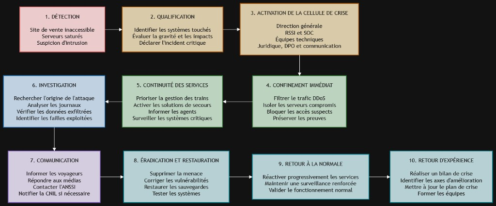

# Remédiation et Législation

**École :** Livecampus  
**Cours :** Remédiation et Législation  
**Professeur :** M. AUMAGY Yannick  
**Livrable :** MINI CAS 2  
**Chapitres couverts :** 4, 5 et 6  
**Modalité :** Travail de **groupe**  
**Groupe :** G1  

**Membres du groupe :**
- BADET Mael
- LEBLOND Tristan
- LOURENCO Quentin
- MASIA Antoine

**Format de dépôt attendu :** `REMEDIATION_ET_LEGISLATION_BADET_LEBLOND_LOURENCO_MASIA_MINI_CAS_2_G1.pdf`

---

## Énoncé du mini-cas

### Contexte

Une grande entreprise de transport ferroviaire en France gère le trafic quotidien de centaines de trains et propose des services en ligne (achat de billets, suivi des trajets, applications mobiles).

Un incident majeur survient un **lundi matin** :

- le **site web de vente de billets** est inaccessible ;
- plusieurs **serveurs internes** sont saturés par une attaque **DDoS** ;
- une **suspicion d’intrusion** dans le système de gestion des trains est remontée par l’équipe sécurité ;
- des messages sur les **réseaux sociaux** affirment que des **données clients** (noms, adresses, numéros de cartes bancaires) auraient été volées ;
- la direction vous confie la mission de **piloter la gestion de cette crise** et de proposer une **réponse complète**.

---

## Réponses aux tâches

### 1. Mettre en place un processus de gestion de crise

*Schéma — chronologie de la gestion de crise (détection → retour d’expérience)*

#### 1. Détection de l’incident

La crise débute par la détection de plusieurs anomalies : indisponibilité du site de vente de billets, saturation de serveurs internes et alerte concernant une possible intrusion dans le système de gestion des trains. Les équipes de supervision et le SOC[^soc] doivent immédiatement centraliser les alertes, ouvrir un incident critique et conserver les premiers journaux techniques.

#### 2. Qualification de l’incident

L’équipe de sécurité analyse rapidement la situation afin d’identifier les systèmes touchés, la nature des attaques et leurs conséquences possibles. Elle doit distinguer l’attaque DDoS[^ddos], la suspicion d’intrusion et la possible fuite de données clients. L’incident est classé comme critique en raison des risques pour la sécurité ferroviaire, les voyageurs, les données personnelles et l’activité commerciale.

#### 3. Activation de la cellule de crise

La direction générale déclenche le plan de gestion de crise et réunit une cellule composée notamment du RSSI[^rssi], du SOC, des équipes informatiques, des responsables métiers, du service juridique, du DPO[^dpo] et de la communication. Un responsable de crise est désigné afin de coordonner les décisions, répartir les rôles et organiser des points de situation réguliers.

#### 4. Confinement immédiat

Les équipes techniques mettent en place les premières mesures d’urgence. Le trafic malveillant lié au DDoS est filtré avec l’aide des opérateurs réseau et des prestataires de protection. Les serveurs potentiellement compromis sont isolés, les accès suspects sont bloqués et les comptes à risque sont désactivés. Les preuves numériques, telles que les journaux, les fichiers et les connexions réseau, doivent être préservées pour l’enquête.

#### 5. Maintien des services essentiels

La priorité est donnée à la sécurité des voyageurs et à la continuité de la circulation des trains. Les systèmes de gestion ferroviaire sont séparés des services commerciaux lorsque cela est possible. Des solutions de secours sont activées pour maintenir les fonctions essentielles, tandis que les agents reçoivent des consignes claires. Les services non prioritaires peuvent être temporairement arrêtés afin de concentrer les ressources sur les systèmes critiques.

#### 6. Investigation

Les équipes de réponse à incident recherchent l’origine et le déroulement de l’attaque. Elles analysent les journaux, les connexions, les fichiers suspects et les éventuels mouvements de l’attaquant dans le réseau. Elles vérifient si le système de gestion des trains a réellement été compromis et si des données clients ont été copiées ou exfiltrées. Cette analyse permet également d’identifier les vulnérabilités exploitées.

#### 7. Communication et notifications

La communication doit être régulière, centralisée et validée par la cellule de crise. Les voyageurs sont informés de l’indisponibilité du site et des solutions alternatives pour acheter leurs billets ou suivre leurs trajets. Les salariés reçoivent des consignes internes afin d’éviter les rumeurs et les erreurs de communication. L’entreprise échange avec les autorités compétentes, notamment l’ANSSI[^anssi], et le DPO évalue la nécessité d’une notification à la CNIL[^cnil] en cas de violation de données personnelles. Aucune fuite de données ne doit être annoncée comme certaine avant d’avoir été confirmée.

#### 8. Éradication et restauration

Une fois l’attaque maîtrisée, les équipes suppriment les logiciels malveillants, ferment les accès utilisés par les attaquants et corrigent les vulnérabilités identifiées. Les mots de passe, clés et certificats potentiellement compromis sont renouvelés. Les serveurs sont restaurés à partir de sauvegardes fiables, puis contrôlés avant leur remise en production.

#### 9. Retour progressif à la normale

Les services sont réactivés progressivement, en commençant par les systèmes indispensables à la circulation des trains, puis les services destinés aux voyageurs et enfin les fonctions moins prioritaires. Chaque remise en service doit être précédée de tests de sécurité et de fonctionnement. Une surveillance renforcée est maintenue afin de détecter une éventuelle reprise de l’attaque. Le retour à la normale n’est validé que lorsque les services sont stables et que la menace est considérée comme éliminée.

#### 10. Retour d’expérience

Après la crise, l’entreprise organise un retour d’expérience afin d’analyser les causes, les décisions prises et les difficultés rencontrées. Les procédures de crise, les protections contre les attaques DDoS, la segmentation des réseaux, les sauvegardes et les moyens de détection sont améliorés. Un plan d’action est établi avec des responsables et des échéances pour éviter qu’un incident similaire ne se reproduise.

### 2. Définir l’organisation de la cellule de crise

Quand un incident comme celui-ci arrive (site inaccessible, DDoS, suspicion d’intrusion, rumeur de vol de données), il faut réunir rapidement une cellule de crise avec des personnes qui ont chacune un rôle bien précis. Voici les principaux profils nécessaires et ce qu’ils doivent faire concrètement.

#### La direction

C’est elle qui prend les décisions finales et qui porte la responsabilité globale de la gestion de la crise. Elle valide les grandes orientations (par exemple : est-ce qu’on ferme temporairement le site de vente en ligne, est-ce qu’on informe publiquement les clients tout de suite ou on attend d’avoir plus d’infos). Elle doit aussi rendre des comptes en interne et parfois aux autorités si la situation l’exige.

#### Le RSSI (responsable de la sécurité des systèmes d’information)

C’est le chef d’orchestre technique de la crise. Il coordonne les équipes IT[^it], analyse la nature de l’attaque (ici, à la fois le DDoS et la suspicion d’intrusion), évalue la gravité et propose les mesures de confinement. C’est lui qui fait le lien entre le terrain technique et la direction, en traduisant les infos complexes en décisions compréhensibles.

#### L’équipe IT

Ce sont les techniciens qui agissent concrètement sur les systèmes : isoler les serveurs touchés, bloquer les adresses IP qui envoient le trafic DDoS, vérifier si l’intrusion dans le système de gestion des trains est réelle, et commencer à restaurer les services une fois la menace confirmée sous contrôle. Ils travaillent sous la coordination du RSSI.

#### Le service communication

Il gère tout ce qui est message vers l’extérieur (et l’intérieur). Vu que des rumeurs circulent déjà sur les réseaux sociaux à propos d’un vol de données clients, c’est un rôle crucial ici : il faut réagir vite pour éviter la panique, sans pour autant donner des infos non vérifiées. Il prépare les communiqués officiels, répond aux médias, et informe aussi les employés en interne pour éviter que tout le monde apprenne les choses par la presse.

#### Le service juridique

Il s’assure que l’entreprise respecte ses obligations légales, notamment si les données personnelles des clients (noms, adresses, numéros de cartes bancaires) sont vraiment compromises. Dans ce cas, il faut par exemple notifier la CNIL dans les délais imposés par le RGPD[^rgpd]. Le juridique évalue aussi les risques de plaintes ou de poursuites, et encadre ce que l’entreprise peut dire publiquement sans s’exposer légalement.

#### Les métiers impactés

Ce sont les équipes opérationnelles directement touchées par l’incident, ici par exemple le service billetterie ou le service qui gère le trafic des trains. Ils doivent faire remonter l’impact concret sur leur activité (est-ce que les trains sont encore en sécurité, est-ce que les voyageurs peuvent acheter des billets autrement) et appliquer les mesures de continuité pendant que la crise est gérée.

### 3. Proposer des mesures de détection et d’analyse

#### Mesures de détection et d’analyse

Pour confirmer l’intrusion et évaluer l’ampleur de l’attaque, il faut utiliser plusieurs outils de détection :

- **Antivirus et antimalwares** pour détecter les logiciels malveillants connus.
- **Pare-feux (firewalls)**[^firewall] pour analyser les connexions réseau suspectes.
- **IDS/IPS**[^ids-ips] (systèmes de détection et de prévention d’intrusion) afin d’identifier les tentatives d’intrusion et de bloquer certaines attaques.
- **SIEM**[^siem] (*Security Information and Event Management*) pour centraliser et analyser les journaux d’événements afin de détecter des activités anormales.
- **SOC** (*Security Operations Center*) pour assurer une surveillance continue des alertes et coordonner l’analyse de l’incident.
- **Honeypots**[^honeypot], pour observer les techniques utilisées par les attaquants.

#### Méthodes d’analyse

L’analyse de l’incident comprend plusieurs étapes :

- **Collecte des preuves** : récupérer les journaux système, les fichiers compromis et les traces réseau.
- **Identification de la cause** : déterminer si l’attaque provient d’une faille, d’un phishing[^phishing], d’un compte compromis ou d’une menace interne.
- **Évaluation de l’impact** : identifier les systèmes touchés, les données compromises et les conséquences sur la continuité des activités.
- **Attribution éventuelle** : tenter d’identifier l’origine de l’attaque (groupe criminel, État, hacktiviste).
- **Documentation des actions** : enregistrer toutes les étapes de l’analyse afin d’assurer la traçabilité et la conformité juridique.

#### Collecte et sécurisation des preuves

Les preuves doivent être collectées et conservées avec soin :

- Capturer des **images mémoire** des systèmes compromis.
- Copier les **journaux d’événements** (logs), les fichiers compromis et les traces réseau.
- Conserver les preuves **sans les modifier** afin de préserver leur intégrité.
- **Documenter** toutes les actions réalisées pour garantir la traçabilité et répondre aux exigences juridiques.

**Résumé :** utiliser les antivirus, pare-feux, IDS/IPS, SIEM, SOC et éventuellement des honeypots pour détecter et confirmer l’intrusion. Analyser les journaux système, les fichiers compromis et les traces réseau afin d’identifier la cause, d’évaluer l’impact et, si possible, d’attribuer l’attaque. Les preuves doivent être collectées (images mémoire, logs, fichiers compromis), sécurisées sans être modifiées et toutes les actions doivent être documentées pour assurer la traçabilité et la conformité juridique.

### 4. Établir un plan de remédiation et de confinement

Face à un incident **multi-vecteurs** (indisponibilité du site de billets, DDoS, suspicion d’intrusion sur le SI de gestion des trains, rumeurs de fuite de données clients), l’entreprise ferroviaire doit **limiter immédiatement les dégâts** sans détruire les preuves utiles à l’analyse. Ce plan s’appuie sur le cours (chapitres 4 et 6) et sur les référentiels ANSSI / CERT-FR[^cert-fr] et NIST.

#### Principes d’action (cours + doctrine)

D’après le **chapitre 6**, la remédiation[^remediation] commence par des actions immédiates (isolement, blocage des accès, correctifs urgents, conservation des preuves, information du RSSI[^rssi] / direction), puis distingue :

- le **confinement à court terme** : stopper la propagation (segmentation, mise hors ligne, restriction des privilèges) ;
- le **confinement à long terme** : durcir l’environnement le temps d’éradiquer (MFA renforcée, surveillance accrue, règles de pare-feu) ;
- l’**éradication** : supprimer malwares, comptes pirates, backdoors, et corriger les failles ;
- la **vérification post-éradication** : analyses forensiques[^forensic] pour s’assurer qu’aucune persistance ne reste.

Le **chapitre 4** rappelle qu’analyse / confinement et remédiation s’inscrivent dans une **cellule de crise**, avec coordination interne, sectorielle (transport) et nationale (**ANSSI**).

Le **NIST SP 800-61**[^nist] (référentiel de gestion des incidents) structure la réponse autour notamment du **confinement**, de l’**éradication** et de la **récupération** : choisir une stratégie de confinement, préserver les preuves, puis éradiquer et récupérer.

#### 1. Remédiation immédiate (0 à 2 heures)

| Action | Objectif dans le cas ferroviaire |
| :--- | :--- |
| **Informer les responsables clés** (direction, RSSI, DSI, métiers trains / digital) | Activer la cellule de crise et figer les décisions (ch. 6-A, CERT-FR « bons réflexes ») |
| **Isoler les systèmes suspects** (serveurs web / billeterie, bastions, postes d’admin) | Couper la propagation ; **ne pas éteindre systématiquement** sans capture mémoire si intrusion suspectée |
| **Segmenter / isoler le SI de gestion des trains** du SI bureautique et d’Internet | Priorité absolue : sécurité des voyageurs et continuité du trafic |
| **Bloquer les accès compromis** (comptes admin, VPN, prestataires) | Empêcher le maintien d’accès attaquant (ch. 6-A) |
| **Mettre les sauvegardes critiques hors ligne / en sûreté** | Éviter chiffrement ou destruction des backups (CERT-FR) |
| **Conserver les preuves** (logs SIEM, images mémoire, dumps réseau) | Copier hors ligne, prolonger la rétention des journaux (ch. 6-A, CERT-FR) |

#### 2. Confinement ciblé selon chaque menace

**A. Attaque DDoS / site de billets inaccessible**

Selon la fiche CERT-FR *Déni de service réseau – Endiguement* :

- ordonner les actions et qualifier le type de DDoS ;
- **limiter le trafic en amont** avec le **FAI**[^fai] / hébergeur (filtrage, blackholing sélectif) ;
- **activer un service anti-DDoS** / CDN[^cdn] si disponible ;
- ajuster DNS / protections applicatives (WAF[^waf]) ;
- **préserver les journaux** des équipements réseau (preuve + analyse) ;
- rester vigilant : un DDoS peut **masquer** une intrusion parallèle (bruit de fond).

**B. Suspicion d’intrusion sur le système de gestion des trains**

- confinement **court terme** : VLAN dédié / air-gap[^airgap] logique, coupure des accès distants non essentiels, restriction des comptes à privilèges (ch. 6-B) ;
- confinement **long terme** : règles de pare-feu temporaires strictes, MFA obligatoire pour les admins OT/IT[^ot-it], journalisation renforcée, monitoring 24/7 (SOC) ;
- faire appel si besoin à un **PRIS** (prestataire qualifié de réponse à incidents) et signaler à l’**ANSSI / CERT-FR** (transport = enjeu national / OSE-OIV selon qualification).

**C. Rumeurs de vol de données clients (CB, noms, adresses)**

- isoler les bases / applications de paiement et billeterie suspectes ;
- révoquer clés API, tokens, certificats et secrets éventuellement exposés ;
- geler les flux de données vers prestataires de paiement le temps de l’investigation ;
- préparer, avec le **DPO**[^dpo] / juridique, la **notification CNIL** (RGPD art. 33, délai **72 h** si risque pour les personnes) et, si risque élevé, l’information des clients (art. 34).

#### 3. Actions techniques de confinement (checklist opérationnelle)

1. **Isolement réseau** : ports switch, ACL[^acl], micro-segmentation entre billeterie, SI interne et SI trains.  
2. **Blocage IP / domaines / URL** malveillants sur pare-feu, proxy et WAF.  
3. **Suspension des comptes** et sessions (Active Directory, cloud, VPN).  
4. **Patchs d’urgence** uniquement sur les brèches confirmées, après capture de preuves (ch. 6-A).  
5. **Communication avec les prestataires** : hébergeur web, FAI, CDN anti-DDoS, éditeur SI trains, PSP[^psp] (paiement), infogérant SOC — exiger filtrage, logs et astreinte (ch. 4-B, coordination privée).  
6. **Coordination nationale** : contact CERT-FR / ANSSI pour accompagnement et déclaration si obligations OIV / OSE / NIS2 (ch. 4-B).

#### 4. Vers l’éradication (après stabilisation)

Une fois le confinement tenu :

- supprimer malwares, scripts, comptes pirates et **backdoors** ;
- reconstruire si besoin les serveurs critiques plutôt que « nettoyer » un système douteux (ch. 6-B) ;
- vérifier l’absence de persistance (forensic) **avant** toute restauration métier large (lien avec la tâche 5).

#### Synthèse priorisée (à lancer immédiatement)

| Priorité | Mesure | Menace ciblée |
| :---: | :--- | :--- |
| P0 | Isoler SI gestion des trains + restreindre privilèges | Intrusion / sécurité voyageurs |
| P0 | Activer anti-DDoS + FAI / hébergeur | DDoS / site billets |
| P0 | Sauvegardes hors ligne + capture des preuves | Toutes |
| P1 | Bloquer IP / comptes / VPN compromis | Intrusion / latéralisation |
| P1 | Contacter prestataires techniques + CERT-FR | Coordination |
| P1 | Évaluation fuite données + piste notification CNIL | Données clients / CB |
| P2 | Patchs ciblés + durcissement (confinement long terme) | Éradication progressive |

**En résumé :** le plan combine **remédiation immédiate** (isolement, blocages, preuves, alerte direction/RSSI) et **confinement à deux horizons** (court / long terme), adaptés à chaque volet de la crise (DDoS, trains, données), avec appui des prestataires et de l’ANSSI — conformément aux chapitres 4 et 6 et aux guides nationaux.

#### Sources

1. Cours Livecampus — *Remédiation et Législation*, **chapitre 6** (remédiation immédiate, confinement, éradication) et **chapitre 4** (gestion de crise, coordination ANSSI / acteurs).  
2. CERT-FR — *Les bons réflexes en cas d’intrusion sur un système d’information* : <https://www.cert.ssi.gouv.fr/les-bons-reflexes-en-cas-dintrusion-sur-un-systeme-dinformation/>  
3. CERT-FR — *Déni de service réseau – Endiguement* (CERTFR-2024-RFX-010) : <https://www.cert.ssi.gouv.fr/fiche/CERTFR-2024-RFX-010/>  
4. ANSSI — *Cyberattaques et remédiation : piloter la remédiation* (volet opérationnel, PDF) : <https://messervices.cyber.gouv.fr/documents-guides/20231218_Volet_operationnel_cyberattaquesetremediation_a5_v1j.pdf>  
5. NIST — *SP 800-61 Rev. 3* (page officielle CSRC) : <https://csrc.nist.gov/pubs/sp/800/61/r3/final> — PDF : <https://nvlpubs.nist.gov/nistpubs/SpecialPublications/NIST.SP.800-61r3.pdf>  
6. CNIL — *Notification d’une violation de données personnelles* (RGPD art. 33, délai 72 h) : <https://www.cnil.fr/fr/services-en-ligne/notifier-une-violation-de-donnees-personnelles>

### 5. Planifier la restauration et la communication

#### Stratégie de restauration

La restauration doit être progressive afin d’éviter de remettre en production un système encore compromis.

L’ordre de priorité est le suivant :

1. **Systèmes de gestion des trains** : ils sont prioritaires car ils concernent directement la sécurité des voyageurs. Les systèmes suspects sont isolés, puis restaurés depuis des sauvegardes saines. Des tests techniques et métier sont réalisés avant leur reconnexion au réseau.
2. **Services d’infrastructure** : les réseaux, annuaires, systèmes d’authentification, DNS[^dns] et outils de supervision doivent ensuite être rétablis pour permettre le fonctionnement sécurisé des autres services.
3. **Information voyageurs** : un service simplifié doit permettre de consulter les horaires, retards et annulations, par exemple grâce à une page de secours indépendante.
4. **Site web, application et billetterie** : le trafic DDoS est filtré avec l’aide de l’opérateur ou d’un prestataire spécialisé. Le site est remis en service progressivement, en commençant par la consultation, puis l’achat de billets.
5. **Services internes et services administratifs** : ils sont restaurés selon leur importance pour l’activité.

Avant toute remise en production, les équipes doivent corriger les vulnérabilités, renouveler les mots de passe et clés compromis, analyser les systèmes et vérifier l’intégrité des sauvegardes. Une surveillance renforcée est maintenue après le redémarrage.

#### Politique de communication

La communication doit être **rapide, régulière, transparente et centralisée**. Un porte-parole unique est désigné afin d’éviter les informations contradictoires.

En interne, la direction informe les agents des services indisponibles, des procédures de secours et des consignes de sécurité. Les équipes techniques et la cellule de crise réalisent des points de situation réguliers. Les salariés ne doivent pas communiquer personnellement avec les médias.

En externe, les voyageurs sont informés par les réseaux sociaux officiels, les annonces en gare, une page de statut indépendante et les communiqués de presse. L’entreprise précise les services indisponibles, les solutions alternatives et l’heure de la prochaine mise à jour.

Concernant la possible fuite de données, l’entreprise ne doit pas confirmer les rumeurs avant la fin des premières investigations. Elle peut indiquer que les vérifications sont en cours. Si une fuite est confirmée, le DPO informe la CNIL dans les délais prévus et prévient les clients concernés en leur donnant les mesures de protection à appliquer.

La fin de crise est annoncée lorsque les services essentiels sont rétablis, sécurisés et suffisamment stables.

---

## Glossaire

Les chiffres en exposant dans le texte (ex. **1.1**, **2.1**, **4.3**) renvoient aux définitions ci-dessous. La première partie du numéro indique la question où le terme apparaît pour la première fois.

///Footnotes Go Here///

[^soc]: **SOC** (*Security Operations Center*) — Centre opérationnel de sécurité qui surveille en continu les alertes, analyse les incidents et coordonne la réponse technique.
[^ddos]: **DDoS** (*Distributed Denial of Service*) — Attaque par déni de service distribué : un grand volume de requêtes provenant de nombreuses sources sature un service (site, serveur) pour le rendre inaccessible.
[^rssi]: **RSSI** (*Responsable de la Sécurité des Systèmes d’Information*) — Cadre chargé de piloter la politique de cybersécurité de l’organisation et de coordonner la réponse aux incidents.
[^dpo]: **DPO** (*Data Protection Officer* / Délégué à la protection des données) — Responsable du respect du RGPD ; intervient notamment pour évaluer et notifier une violation de données à la CNIL.
[^anssi]: **ANSSI** — Agence nationale de la sécurité des systèmes d’information. Autorité nationale française en cybersécurité ; accompagne et oriente en cas d’incident majeur.
[^cnil]: **CNIL** — Commission nationale de l’informatique et des libertés. Autorité de contrôle du RGPD en France ; doit être notifiée en cas de violation de données personnelles (art. 33).
[^it]: **IT** (*Information Technology*) — Systèmes d’information « classiques » (serveurs, postes, applications métier, web), par opposition aux systèmes industriels (OT).
[^rgpd]: **RGPD** — Règlement général sur la protection des données (UE). Impose notamment la notification à l’autorité (CNIL) sous **72 h** en cas de violation présentant un risque pour les personnes.
[^firewall]: **Pare-feu (*firewall*)** — Équipement ou logiciel qui filtre le trafic réseau selon des règles (autoriser / refuser) pour protéger un SI.
[^ids-ips]: **IDS / IPS** — *Intrusion Detection System* (détecte les intrusions) / *Intrusion Prevention System* (détecte et peut bloquer automatiquement certaines attaques).
[^siem]: **SIEM** (*Security Information and Event Management*) — Plateforme qui centralise les journaux (logs) et détecte des corrélations / anomalies pour alerter le SOC.
[^honeypot]: **Honeypot** — Leurre informatique (système ou service leurre) destiné à attirer les attaquants afin d’observer leurs techniques sans exposer le SI de production.
[^phishing]: **Phishing** — Technique d’ingénierie sociale qui vise à tromper une victime (e-mail, SMS, site faux) pour lui soutirer des identifiants ou déployer un malware.
[^cert-fr]: **CERT-FR** — Centre gouvernemental français de veille, d’alerte et de réponse aux attaques informatiques (rattaché à l’ANSSI). Il publie des fiches réflexes et peut accompagner les incidents majeurs.
[^remediation]: **Remédiation** — Ensemble des actions visant à corriger un incident de sécurité : isoler les systèmes touchés, bloquer les accès compromis, appliquer des correctifs et ramener le SI vers un état sain.
[^forensic]: **Analyse forensique** (ou *forensics*) — Investigation numérique visant à collecter, préserver et analyser des preuves (journaux, mémoire, disques) pour comprendre l’attaque sans altérer les traces.
[^nist]: **NIST SP 800-61** — Publication du *National Institute of Standards and Technology* (États-Unis) sur la gestion des incidents de cybersécurité. La version actuelle est la **Rev. 3** (2025). Elle formalise notamment les logiques de **confinement**, d’**éradication** et de **récupération**.
[^fai]: **FAI** (*Fournisseur d’Accès à Internet*) — Opérateur qui fournit la connectivité Internet (et souvent le filtrage anti-DDoS en amont).
[^cdn]: **CDN** (*Content Delivery Network*) — Réseau de serveurs répartis qui diffuse un site web plus près des utilisateurs et peut absorber / filtrer une partie du trafic d’attaque (dont le DDoS).
[^waf]: **WAF** (*Web Application Firewall*) — Pare-feu applicatif qui filtre les requêtes HTTP malveillantes vers un site ou une API (injections, bots, etc.).
[^airgap]: **Air-gap** (litt. « coupure d’air ») — Isolation forte d’un système, idéalement sans lien réseau avec Internet ou le reste du SI. Un *air-gap logique* désigne une isolation par segmentation très stricte.
[^ot-it]: **OT / IT** — *Operational Technology* (systèmes industriels / métier, ex. gestion des trains) versus *Information Technology* (bureautique, serveurs, web). Les deux mondes doivent être cloisonnés.
[^acl]: **ACL** (*Access Control List*) — Liste de règles qui autorise ou refuse le trafic réseau (ou des accès fichiers) selon des critères (IP, ports, utilisateurs…).
[^psp]: **PSP** (*Payment Service Provider*) — Prestataire de services de paiement qui gère les transactions par carte bancaire pour le compte du marchand (ici, la billeterie).
[^dns]: **DNS** (*Domain Name System*) — Service qui traduit les noms de domaine (ex. billetterie.exemple.fr) en adresses IP ; critique pour le fonctionnement des sites et applications.
